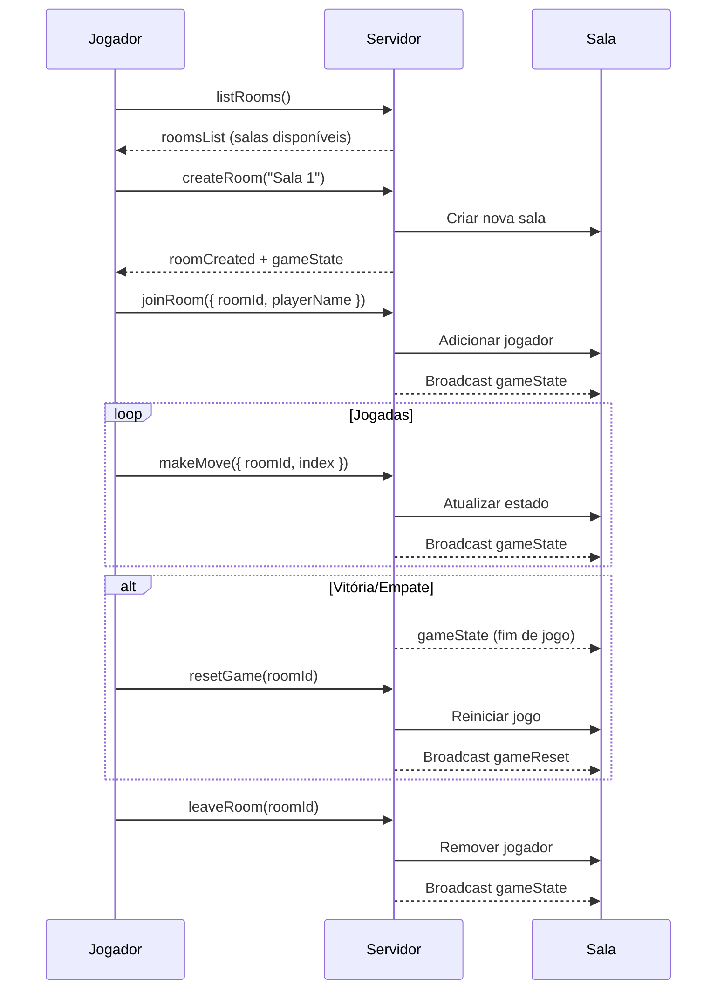

# Jogo da Velha Online com WebSocket

Um jogo da velha multiplayer em tempo real usando React, Node.js e Socket.IO, com suporte a múltiplas salas de jogo simultâneas.

## O que é WebSocket?
`WebSocket` é um protocolo de comunicação que permite a transmissão de dados bidirecional entre cliente e servidor por meio de uma conexão persistente. Diferente do modelo tradicional HTTP, onde o cliente precisa fazer uma requisição para obter uma resposta, o WebSocket mantém a conexão aberta, permitindo que servidor e cliente troquem mensagens em tempo real, sem a necessidade de recarregar a página.

Esse protocolo é ideal para aplicações que exigem interatividade instantânea, como:

- Jogos multiplayer online
- Chats em tempo real
- Notificações ao vivo
- Sistemas de monitoramento

## Como o WebSocket funciona neste projeto
Este projeto utiliza a biblioteca Socket.IO para estabelecer uma comunicação em tempo real entre os jogadores, através de eventos WebSocket personalizados. Isso permite que os jogadores joguem simultaneamente com atualizações instantâneas.

A comunicação entre cliente e servidor é feita principalmente por meio dos seguintes tipos de eventos:

### 1. Gerenciamento de Salas

Quando um usuário acessa o jogo, ele pode:

```javascript
// Listar salas disponíveis
socket.emit("listRooms")

// Criar uma nova sala
socket.emit("createRoom", nomeDaSala)

// Entrar em uma sala
socket.emit("joinRoom", { roomId, playerName })

// Sair de uma sala
socket.emit("leaveRoom", roomId)
```

O servidor responde com:

```javascript
// Lista de salas atualizada
socket.on("roomsList", (salas) => {
  // Atualiza interface com lista de salas
})

// Confirmação de sala criada
socket.on("roomCreated", (roomId) => {
  // Sala criada com sucesso
})

// Erro (sala já existe, sala cheia, etc)
socket.on("error", (mensagem) => {
  // Exibe mensagem de erro
})
```

### 2. Jogador faz uma jogada

Quando um jogador clica em uma célula do tabuleiro:

```javascript
socket.emit("makeMove", { roomId, index })
```

O servidor processa a jogada e atualiza o estado:

```javascript
socket.on("makeMove", ({ roomId, index }) => {
  // Valida a jogada, atualiza o tabuleiro, checa vitória ou empate
  // Emite o estado do jogo para todos os jogadores na sala
})
```

### 3. Reinício da partida
Para começar uma nova rodada na mesma sala:

```javascript
socket.emit("resetGame", roomId)
```

O servidor reinicia o estado do jogo:

```javascript
socket.on("resetGame", (roomId) => {
  resetGame(roomId)
  io.to(roomId).emit("gameReset", gameState)
})
```

### 4. Desconexão e Reconexão
O sistema gerencia automaticamente desconexões:

```javascript
socket.on("disconnect", () => {
  // Remove jogador das salas
  // Notifica outros jogadores
  // Atualiza estado das salas
})
```

## 🔄 Diagrama de Comunicação via WebSocket



## 🚀 Funcionalidades

- ✅ Múltiplas salas de jogo simultâneas
- ✅ Sistema de criação e gerenciamento de salas
- ✅ Lista de salas disponíveis em tempo real
- ✅ Jogo da velha multiplayer em tempo real
- ✅ WebSocket para comunicação instantânea
- ✅ Sistema de placar com contagem de vitórias
- ✅ Interface moderna e responsiva
- ✅ Nomes personalizados para jogadores
- ✅ Detecção automática de vitória e empate
- ✅ Reconexão automática
- ✅ Status do jogo em tempo real

## 🛠️ Tecnologias

### Frontend
- React 18
- Next.js 14
- TypeScript
- Tailwind CSS
- Socket.IO Client
- Shadcn/ui Components

### Backend
- Node.js
- Express.js
- Socket.IO
- CORS

## 📁 Estrutura do Projeto

```
jogo_da_velha/
├── app/                   # Frontend React/Next.js
│   ├── page.tsx           # Componente principal do jogo
│   ├── layout.tsx         # Layout da aplicação
│   └── globals.css        # Estilos globais
├── server/                # Backend Node.js
│   ├── server.js          # Servidor WebSocket
│   └── package.json       # Dependências do servidor
├── components/            # Componentes UI (shadcn/ui)
└── README.md
```

## 🚀 Como Executar

### 1. Instalar Dependências do Servidor

```bash
cd server
npm install
```

### 2. Iniciar o Servidor

```bash
npm run dev
# ou
npm start
```

O servidor estará rodando em `http://localhost:3001`

### 3. Instalar Dependências do Frontend

No diretório raiz do projeto:

```bash
npm install
```

### 4. Iniciar o Frontend

```bash
npm run dev
```

O frontend estará disponível em `http://localhost:3000`

### 5. Scripts
Você pode rodar os comandos

```bash
bash scripts/install-dependencies.sh
```

```bash
bash scripts/setup.sh
```

```bash
bash scripts/start-project.sh
```

Para instalar as dependencias e iniciar o projeto, respectivamente.

## 🎮 Como Jogar

1. Acesse `http://localhost:3000`
2. Digite seu nome
3. Crie uma nova sala ou entre em uma sala existente
4. Aguarde outro jogador se conectar à mesma sala
5. Jogue alternadamente clicando nas células do tabuleiro
6. O placar é atualizado automaticamente após cada partida
7. Clique em `Jogar Novamente` para uma nova partida na mesma sala
8. Use o botão `Sair` para deixar a sala atual

## 📡 Eventos WebSocket

### Cliente → Servidor
- `joinGame(playerName)`: Entrar no jogo com nome
- `makeMove(index)`: Fazer jogada na posição especificada
- `resetGame()`: Resetar o jogo atual

### Servidor → Cliente
- `gameState(state)`: Estado completo do jogo
- `waitingForPlayer()`: Aguardando outro jogador
- `gameReset(state)`: Jogo foi resetado

### Demonstração
[Assista ao vídeo no YouTube](https://youtu.be/Dy7C7IFmff8?si=HRZtAxDUkj7e6woS)
