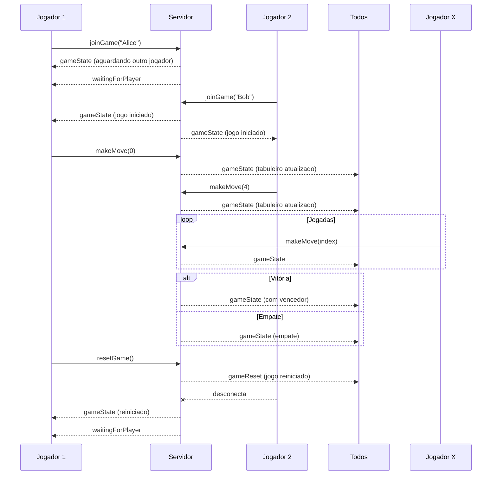

# Jogo da Velha Online com WebSocket

Um jogo da velha multiplayer em tempo real usando React, Node.js e Socket.IO.

## O que é WebSocket?
`WebSocket` é um protocolo de comunicação que permite a transmissão de dados bidirecional entre cliente e servidor por meio de uma conexão persistente. Diferente do modelo tradicional HTTP, onde o cliente precisa fazer uma requisição para obter uma resposta, o WebSocket mantém a conexão aberta, permitindo que servidor e cliente troquem mensagens em tempo real, sem a necessidade de recarregar a página.

Esse protocolo é ideal para aplicações que exigem interatividade instantânea, como:

- Jogos multiplayer online
- Chats em tempo real
- Notificações ao vivo
- Sistemas de monitoramento

## Como o WebSocket funciona neste projeto
Este projeto utiliza a biblioteca Socket.IO para estabelecer uma comunicação em tempo real entre os jogadores, através de eventos WebSocket personalizados. Isso permite que os jogadores joguem simultaneamente com atualizações instantâneas.

A comunicação entre cliente e servidor é feita principalmente por meio de três tipos de eventos:

### 1. Jogador entra no jogo

Assim que um jogador acessa o jogo e informa seu nome, o frontend emite:

```javascript
socket.emit("joinGame", nomeDoJogador)
```

O servidor escuta esse evento com:

```javascript
socket.on("joinGame", (playerName) => {
  // Adiciona o jogador, define o símbolo (X ou O) e inicia o jogo
})
```
Se for o segundo jogador, o jogo começa automaticamente. Caso contrário, o jogador vê a mensagem `Aguardando outro jogador`.


### 2. Jogador faz uma jogada

Quando um jogador clica em uma célula do tabuleiro, o frontend envia ao servidor a posição escolhida:

```javascript
socket.emit("makeMove", index)
```

O servidor recebe esse evento, processa a jogada e atualiza o estado do jogo:

```javascript
socket.on("makeMove", (index) => {
  // Valida a jogada, atualiza o tabuleiro, checa vitória ou empate
  // Emite o estado do jogo para todos os jogadores
})
```

Em seguida, o servidor envia o estado atualizado para todos com:
```javascript
io.emit("gameState", gameState)
```

No frontend, isso é recebido com:
```javascript
socket.on("gameState", (estado) => {
  // Atualiza a interface do tabuleiro e exibe o vencedor ou empate
})
```

### 3. Reinício da partida
Se os jogadores quiserem começar uma nova rodada, um deles pode clicar em “Jogar Novamente”, e o frontend envia:

```javascript
socket.emit("resetGame")
```

O servidor reinicia o estado do jogo com:

```javascript
socket.on("resetGame", () => {
  resetGame()
  io.emit("gameReset", gameState)
})
```

E no cliente:

```javascript
socket.on("gameReset", (novoEstado) => {
  // Limpa o tabuleiro e inicia uma nova partida
})
```


### 4. Desconexão de jogador
Quando um jogador fecha a aba ou sai do jogo, o servidor automaticamente detecta isso:

```javascript
socket.on("disconnect", () => {
  // Remove o jogador e reinicia o jogo, se necessário
  io.emit("gameState", gameState)
})
```

Se restar apenas um jogador, ele verá a mensagem de que está aguardando um novo oponente:

```javascript
socket.on("waitingForPlayer", () => {
  // Exibe no frontend uma mensagem aguardando o segundo jogador
})
```

## 🔄 Diagrama de Comunicação via WebSocket




## 🚀 Funcionalidades

- ✅ Jogo da velha multiplayer em tempo real
- ✅ WebSocket para comunicação instantânea
- ✅ Sistema de placar com contagem de vitórias
- ✅ Interface moderna e responsiva
- ✅ Nomes personalizados para jogadores
- ✅ Detecção automática de vitória e empate
- ✅ Reconexão automática
- ✅ Status do jogo em tempo real

## 🛠️ Tecnologias

### Frontend
- React 18
- Next.js 14
- TypeScript
- Tailwind CSS
- Socket.IO Client
- Shadcn/ui Components

### Backend
- Node.js
- Express.js
- Socket.IO
- CORS

## 📁 Estrutura do Projeto

```
jogo_da_velha/
├── app/                   # Frontend React/Next.js
│   ├── page.tsx           # Componente principal do jogo
│   ├── layout.tsx         # Layout da aplicação
│   └── globals.css        # Estilos globais
├── server/                # Backend Node.js
│   ├── server.js          # Servidor WebSocket
│   └── package.json       # Dependências do servidor
├── components/            # Componentes UI (shadcn/ui)
└── README.md
```

## 🚀 Como Executar

### 1. Instalar Dependências do Servidor

```bash
cd server
npm install
```

### 2. Iniciar o Servidor

```bash
npm run dev
# ou
npm start
```

O servidor estará rodando em `http://localhost:3001`

### 3. Instalar Dependências do Frontend

No diretório raiz do projeto:

```bash
npm install
```

### 4. Iniciar o Frontend

```bash
npm run dev
```

O frontend estará disponível em `http://localhost:3000`

### 5. Scripts
Você pode rodar os comandos

```bash
bash scripts/install-dependencies.sh
```

```bash
bash scripts/setup.sh
```

```bash
bash scripts/start-project.sh
```

Para instalar as dependencias e iniciar o projeto, respectivamente.

## 🎮 Como Jogar

1. Acesse `http://localhost:3000`
2. Digite seu nome e clique em `Entrar no Jogo`
3. Aguarde outro jogador se conectar
4. Jogue alternadamente clicando nas células do tabuleiro
5. O placar é atualizado automaticamente após cada partida
6. Clique em `Jogar Novamente` para uma nova partida

## 📡 Eventos WebSocket

### Cliente → Servidor
- `joinGame(playerName)`: Entrar no jogo com nome
- `makeMove(index)`: Fazer jogada na posição especificada
- `resetGame()`: Resetar o jogo atual

### Servidor → Cliente
- `gameState(state)`: Estado completo do jogo
- `waitingForPlayer()`: Aguardando outro jogador
- `gameReset(state)`: Jogo foi resetado
